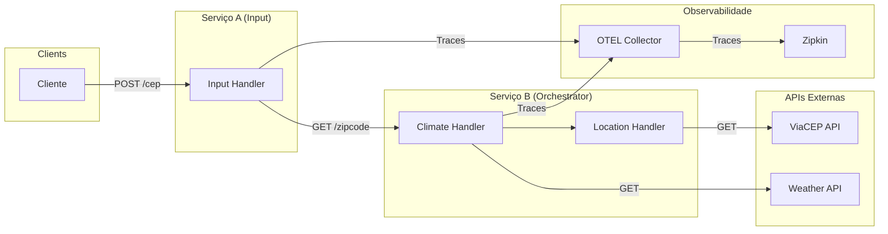
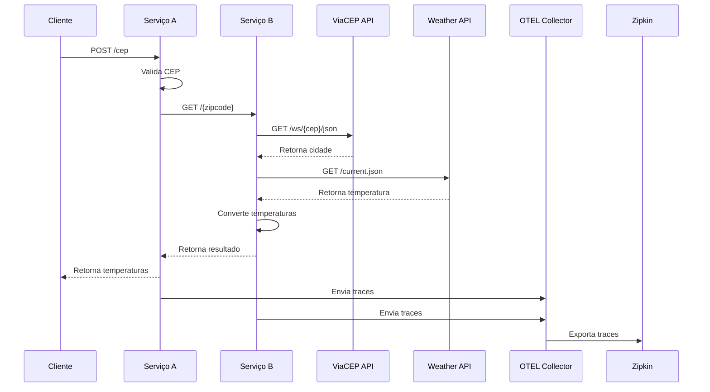
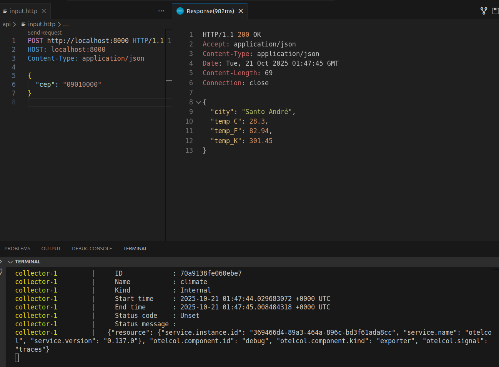
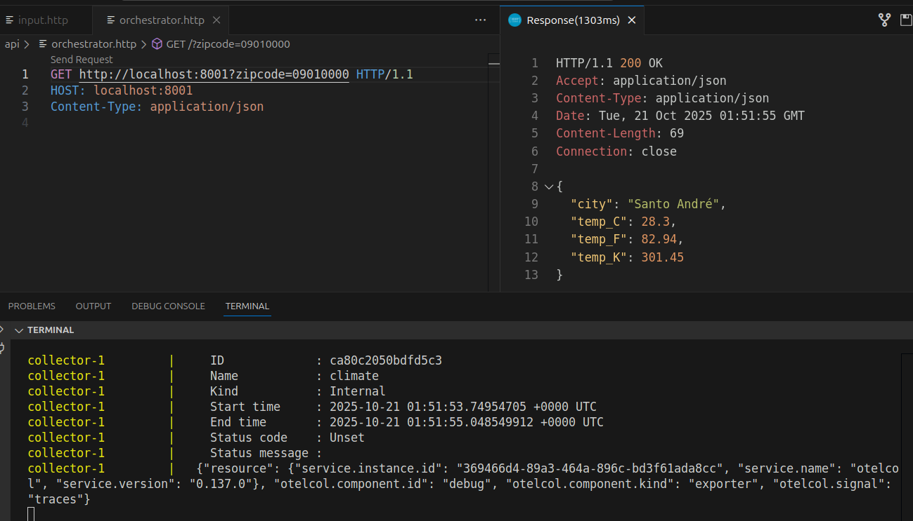

<!-- markdownlint-disable MD007 MD031 MD034 -->
# Go Expert Labs - OpenTelemetry Challenge

Implementação de um **Sistema Distribuído em Go** utilizando **OpenTelemetry** e **Zipkin** para rastreamento distribuído, composto por dois serviços que consultam CEP e temperatura.

---

## 📐 Arquitetura

A aplicação é composta por:
- **Serviço A (Input)**: Responsável por receber e validar o CEP
- **Serviço B (Orchestrator)**: Responsável por consultar APIs externas e processar dados
- **OpenTelemetry Collector**: Coleta e processamento de traces
- **Zipkin**: Visualização e análise de traces



### Fluxo de funcionamento

1. Cliente envia CEP para o Serviço A
2. Serviço A valida o formato do CEP
3. Serviço A encaminha para o Serviço B
4. Serviço B consulta ViaCEP para obter a cidade
5. Serviço B consulta WeatherAPI para obter temperatura
6. Serviço B converte temperaturas e retorna resposta
7. Todas as operações são rastreadas via OpenTelemetry

### Diagrama de Sequência



---

## 📂 Estrutura de Pastas

```text
otel-lab/
├── cmd/
│   ├── input/         # Serviço A - Entrada de CEP
│   └── orchestrator/  # Serviço B - Orquestrador
│
├── config/
│   └── config.go      # Configurações e variáveis de ambiente
│
├── internal/
│   ├── entities/      # Entidades e DTOs
│   ├── infra/
│   │   └── web/      # Configuração HTTP e handlers
│   ├── pkg/          # Pacotes utilitários
│   └── usecases/     # Regras de negócio
│
├── .docker/
│   └── otel/         # Configuração do OpenTelemetry Collector
│
├── scripts/
│   └── test.sh       # Scripts de teste
│
├── .env.example      # Template de variáveis de ambiente
├── Dockerfile.*      # Dockerfiles dos serviços
├── docker-compose.yml
├── Makefile
└── README.md
```

## ⚙️ Configuração

A configuração é feita via variáveis de ambiente (`.env`):

```sh
LOG_LEVEL=debug

# Portas dos serviços
INPUT_SERVICE_WEB_SERVER_PORT=8000
ORCHESTRATOR_SERVICE_WEB_SERVER_PORT=8001

# Timeout do cliente HTTP
HTTP_CLIENT_TIMEOUT_MS=5000

# URLs das APIs
VIACEP_API_BASE_URL="https://viacep.com.br/ws"
WEATHER_API_BASE_URL="https://api.weatherapi.com"
WEATHER_API_KEY="sua-chave-aqui"

# Endereço do Orchestrator
ORCHESTRATOR_SERVICE_HOST="http://api_orchestrator:8001"

# OpenTelemetry
OTEL_COLLECTOR_URL="collector:4317"
```

## ▶️ Executando o Projeto

### Requisitos

1. Clone o repositório
2. Execute `make env` para criar os arquivos de ambiente
3. Edite `.env` e `.env.docker` e configure sua `WEATHER_API_KEY`

### Via Docker
```sh
make up
```
Ou 
```sh
docker-compose up -d --build
```

Serviços disponíveis:
- Input API: http://localhost:8000
- Orchestrator API: http://localhost:8001
- Zipkin: http://localhost:9411

**Obs:** Ao atualizar o código, use `docker compose up --build` para recriar os containers.

### Desenvolvimento Local

1. Execute os serviços de observabilidade:
```sh
docker compose up -d collector zipkin
```

2. Execute os serviços em terminais separados:
```sh
make run-input
make run-orchestrator
```

---

## 🔍 Observabilidade

### OpenTelemetry
- Rastreamento distribuído entre serviços
- Medição de latência de operações
- Propagação de contexto
- Exportação para Zipkin

### Spans Rastreados
- Validação de CEP
- Consulta à ViaCEP
- Consulta à WeatherAPI
- Conversão de temperaturas
- Comunicação entre serviços

### Visualização no Zipkin
1. Acesse http://localhost:9411
2. Clique em "Find Traces"
3. Visualize os traces completos
4. Analise spans individuais

---

## 🧪 Testes Automatizados

Execute os testes:
```sh
make test
```

---

## 📝 Evidências

### Traces no Zipkin

*Visualização dos traces distribuídos entre os serviços de input e orchestrator*

### Requisição POST via serviço Input

*Exemplo de requisição bem-sucedida para consulta de temperatura por CEP*


### Requisição GET via serviço Orchestrator

*Exemplo de requisição bem-sucedida para consulta de temperatura por CEP*

---

## 🌐 Documentação dos endpoints

### Input API

| Endpoint | Descrição                                   | Método  | Body                  |
|----------|-------------------------------------------  |-------- |-----------------------|
| /        | Invoca o serviço de temperatura para um CEP | POST    | `{ "cep": "29902555" }` |

### Orchestrator API

#### Request

| Endpoint | Descrição                                 | Método |  Parâmetro |
|----------|-------------------------------------------|--------|------------|
| /        | Calcula a temperatura atual em uma cidade | GET    | `zipcode`    |

#### Response

- Sucesso:
  - **Código:** 200
  - **Body:**
    ```json
    {
      "city": "São Paulo",
      "temp_C": 23.0,
      "temp_F": 73.4,
      "temp_K": 296.15
    }
    ```

- CEP não encontrado:
    - **Código:** 404
    - **Body:**
      ```json
      {
        "message": "zipcode not found"
      }
      ```

- CEP inválido:
    - **Código:** 422
    - **Body:**
      ```json
      {
        "message": "invalid zipcode"
      }
      ```
