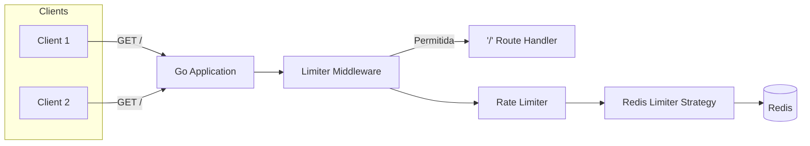
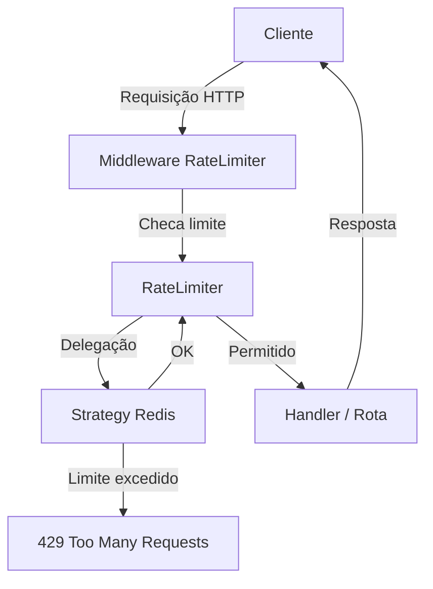
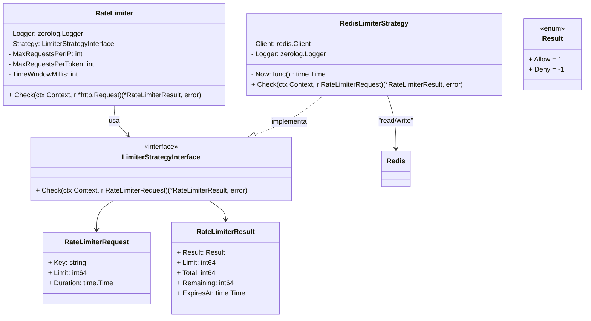

# Go Expert Challenge - Rate Limiter

Implementação de um **Rate Limiter em Go** para serviços Web, capaz de limitar o número de requisições recebidas dentro de uma janela de tempo configurável, com suporte a checagem por **endereço IP** e/ou por **token de acesso (`API_KEY`)**.

---

## 📐 Arquitetura

A aplicação é composta por:
- Um **servidor web** baseado em [Chi Router](https://github.com/go-chi/chi);
- Um **middleware de rate limiting** que intercepta todas as requisições;
- O **RateLimiter** central que aplica as regras de negócio;
- Uma **Strategy de armazenamento** (atualmente Redis).



### Fluxo de funcionamento

1. O middleware recebe a requisição.
2. Ele invoca o `RateLimiter` para checar se pode ou não prosseguir.
3. O `RateLimiter` delega a persistência para a strategy injetada (Redis).
4. Caso o limite seja atingido, retorna `429 Too Many Requests`.

### Diagrama de fluxo



---

## 💾 Estratégia de armazenamento

A aplicação segue o padrão **Strategy**.  
Atualmente, existe a implementação `RedisStrategy`, mas a interface permite criar novas implementações (ex.: memória local, banco de dados SQL/NoSQL).  

- `LimiterStrategyInterface` → expõe o método `Check`  
- `RedisStrategy` → implementação usando Redis para contar requisições por IP ou token  

Assim, novas estratégias podem ser injetadas sem alterar a lógica principal.


---

## 📊 Benchmarks

Foram realizados testes de carga utilizando [Grafana k6](https://k6.io/).  
Dois cenários foram avaliados:

- **Smoke Test** → execução curta para verificar se o sistema está saudável.  
- **Stress Test** → execução longa e intensiva para avaliar robustez sob carga.  

Os resultados estão disponíveis em [BENCHMARKS.md](./BENCHMARKS.md) e nas pastas `./scripts/k6/smoke` e `./scripts/k6/stress`.

---

## 📂 Estrutura de Pastas

```text
challenge-rate-limiter/
├── cmd/
│   └── api/                   # Ponto de entrada da aplicação (main.go)
│
├── config/
│   └── config.go              # Leitura e injeção de variáveis de ambiente
│
├── internal/
│   ├── infra/
│   │   ├── database/
│   │   │   └── redis.go       # Conexão e abstração com Redis
│   │   └── web/
│   │       ├── handlers/      # Handlers HTTP (ex.: HelloHandler)
│   │       ├── middlewares/   # Middlewares (ex.: RateLimiterMiddleware)
│   │       ├── router.go      # Configuração de rotas
│   │       └── webserver.go   # Inicialização do servidor web
│   │
│   └── pkg/
│       ├── dependencyinjector/ # Container de dependências
│       ├── logger/             # Logger (zerolog)
│       ├── mocks/              # Mocks para testes
│       ├── ratelimiter/        # Regras de negócio do RateLimiter
│       │   └── strategies/     # Estratégias de armazenamento (Redis, etc.)
│       └── responsehandler/    # Padronização de respostas HTTP
│
├── scripts/
│   └── k6/                     # Scripts para testes de carga
│
├── docs/
│   └── diagram/                # Diagramas de arquitetura
│
├── .env.example                # Exemplo de variáveis de ambiente
├── BENCHMARKS.md               # Resultados de benchmarks
├── Dockerfile                  # Dockerfile da aplicação
├── docker-compose.yml          # Orquestração Docker (app + Redis)
├── Makefile                    # Atalhos para build/test
├── go.mod                      # Dependências Go
├── go.sum
└── README.md
```

---

## ⚙️ Configuração

Toda a configuração é feita via variáveis de ambiente (`.env`):

```sh
LOG_LEVEL=debug
WEB_SERVER_PORT=8080

REDIS_HOST=localhost
REDIS_PORT=6379
REDIS_PASSWORD=
REDIS_DB=0

RATE_LIMITER_IP_MAX_REQUESTS=10
RATE_LIMITER_TOKEN_MAX_REQUESTS=100
RATE_LIMITER_TIME_WINDOW_MILISECONDS=300000
```

---

## ▶️ Executando o Projeto

> ⚠️ Pré-requisitos: [Docker](https://www.docker.com/) + [Docker Compose](https://docs.docker.com/compose/)

1. Copie `.env.example` para `.env` e ajuste conforme necessário.
2. Suba os serviços:
```sh
docker compose up redis api
```

A API estará disponível em: **http://localhost:8080**

---

## 🌐 Exemplos de Requisição

### ✅ Requisição via IP (permitida)
```sh
$ curl -vvv http://localhost:8080

* Host localhost:8080 was resolved.
* IPv6: ::1
* IPv4: 127.0.0.1
*   Trying [::1]:8080...
* Connected to localhost (::1) port 8080
> GET / HTTP/1.1
> Host: localhost:8080
> User-Agent: curl/8.5.0
> Accept: */*
> 
< HTTP/1.1 200 OK
< Accept: application/json
< Content-Type: application/json
< X-Ratelimit-Limit: 10
< X-Ratelimit-Remaining: 0
< X-Ratelimit-Reset: 1755393088
< Date: Sun, 17 Aug 2025 01:06:35 GMT
< Content-Length: 27
< 
{"message":"Hello World!"}
```

### ❌ Requisição via IP (bloqueada)
```sh
$ curl -vvv http://localhost:8080

* Host localhost:8080 was resolved.
* IPv6: ::1
* IPv4: 127.0.0.1
*   Trying [::1]:8080...
* Connected to localhost (::1) port 8080
> GET / HTTP/1.1
> Host: localhost:8080
> User-Agent: curl/8.5.0
> Accept: */*
> 
< HTTP/1.1 429 Too Many Requests
< Accept: application/json
< Content-Type: application/json
< X-Ratelimit-Limit: 10
< X-Ratelimit-Remaining: 0
< X-Ratelimit-Reset: 1755393087
< Date: Sun, 17 Aug 2025 01:06:35 GMT
< Content-Length: 34
< 
{"message":"rate limit exceeded"}
```

### ✅ Requisição via Token (permitida)
```sh
$ curl -H 'API_KEY: some-api-key-123' -vvv http://localhost:8080

* Host localhost:8080 was resolved.
* IPv6: ::1
* IPv4: 127.0.0.1
*   Trying [::1]:8080...
* Connected to localhost (::1) port 8080
> GET / HTTP/1.1
> Host: localhost:8080
> User-Agent: curl/8.5.0
> Accept: */*
> API_KEY: some-api-key-123
> 
< HTTP/1.1 200 OK
< Accept: application/json
< Content-Type: application/json
< X-Ratelimit-Limit: 100
< X-Ratelimit-Remaining: 99
< X-Ratelimit-Reset: 1755393221
< Date: Sun, 17 Aug 2025 01:08:41 GMT
< Content-Length: 27
< 
{"message":"Hello World!"}
```

### ❌ Requisição via Token (bloqueada)
```sh
$ curl -H 'API_KEY: some-api-key-123' -vvv http://localhost:8080

* Host localhost:8080 was resolved.
* IPv6: ::1
* IPv4: 127.0.0.1
*   Trying [::1]:8080...
* Connected to localhost (::1) port 8080
> GET / HTTP/1.1
> Host: localhost:8080
> User-Agent: curl/8.5.0
> Accept: */*
> API_KEY: some-api-key-123
> 
< HTTP/1.1 429 Too Many Requests
< Accept: application/json
< Content-Type: application/json
< X-Ratelimit-Limit: 10
< X-Ratelimit-Remaining: 0
< X-Ratelimit-Reset: 1755393760
< Date: Sun, 17 Aug 2025 01:17:47 GMT
< Content-Length: 34
< 
{"message":"rate limit exceeded"}
```

---

## 🧪 Testes Automatizados

### Unitários
```sh
make test
```

### Stress/Smoke (k6)
1. Suba a app e o Redis:
   ```sh
   docker compose up redis api
   ```
2. Execute:
   ```sh
   make test_k6_smoke   # Teste curto
   make test_k6_stress  # Teste longo
   ```

Logs e relatórios em `./scripts/k6/smoke` e `./scripts/k6/stress`.

---

## 📌 Próximos Passos

- Novas strategies (memória local, banco relacional, etc.)
- Diferentes algoritmos de rate limiting (Token Bucket, Sliding Window)
- Métricas Prometheus para monitoramento
- Suporte a múltiplos formatos de configuração (YAML/JSON além de `.env`)
